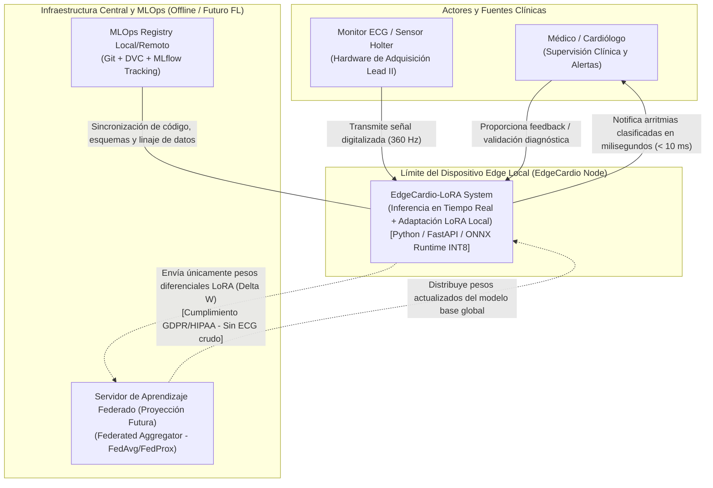
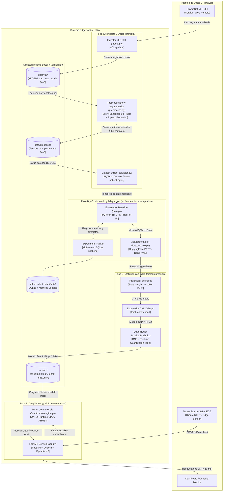
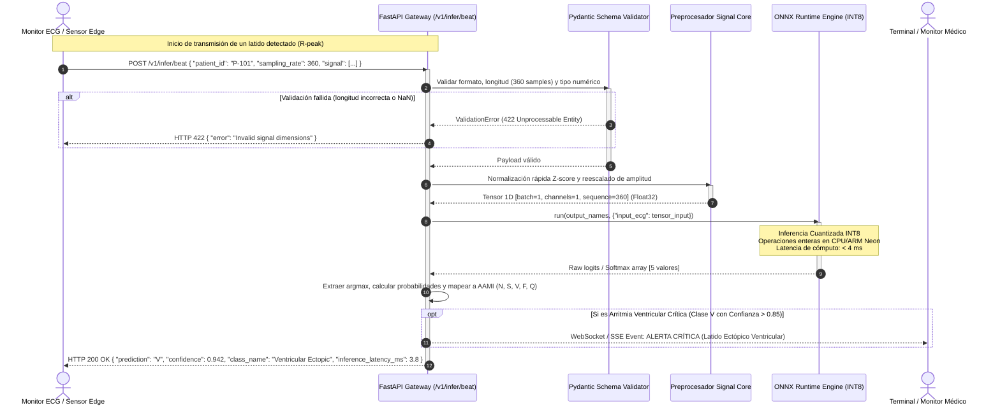

# Arquitectura del Sistema: EdgeCardio-LoRA

Pipeline End-to-End para el diagnóstico automático de anomalías en señales de Electrocardiograma (ECG), optimizado para dispositivos de computación en el borde (*Edge AI*) mediante Parameter-Efficient Fine-Tuning (LoRA) y Cuantización a INT8, con diseño preparado para Aprendizaje Federado (*Federated Learning*).

---

## 1. Visión del Sistema y Alcance Técnico

**EdgeCardio-LoRA** es una plataforma de inferencia médica en el extremo diseñada para clasificar arritmias cardíacas en tiempo real bajo severas restricciones de cómputo y memoria (hardware empotrado ARM Cortex-A y x86-64 de bajo consumo).

El sistema desacopla el ciclo de vida del modelo de aprendizaje profundo en tres capas operativas:
1. **Pipeline de Ingesta y Linaje:** Adquisición determinista del estándar MIT-BIH, preprocesado de señal biomédica (filtrado Butterworth y detección de ondas R) y control estricto de particiones inter-paciente con DVC.
2. **Ciclo de Entrenamiento y Adaptación:** Extracción de características con redes convolucionales 1D en PyTorch y personalización fisiológica por paciente mediante matrices de bajo rango (LoRA / PEFT), minimizando el riesgo de *catastrophic forgetting*.
3. **Optimización y Despliegue Edge:** Compresión mediante fusión de grafos y cuantización entera (INT8), servida a través de un microservicio FastAPI sobre ONNX Runtime con latencias inferiores a 10 ms por latido y un consumo en memoria RAM inferior a 35 MB.

---

## 2. Marco Clínico y Formulación del Problema

### 2.1. Dataset y Derivación Objetivo
- **Dataset:** *MIT-BIH Arrhythmia Database* (PhysioNet), compuesto por 48 registros de electrocardiografía ambulatoria de dos canales de 30 minutos de duración cada uno, digitalizados a 360 muestras por segundo (360 Hz) con resolución de 11 bits.
- **Derivación Principal:** Derivación bipolar de extremidades modificada II (**Lead II / MLII**), por presentar la mayor visibilidad de la onda P, el complejo QRS y la onda T en la mayoría de los registros.

### 2.2. Estándar de Clasificación AAMI EC57
Para garantizar comparabilidad clínica y evitar métricas espurias, se adopta el estándar de la *Association for the Advancement of Medical Instrumentation* (**AAMI EC57**), que mapea las más de 15 anotaciones nativas de PhysioNet en **5 superclases de latidos**:

| Superclase AAMI | Descripción Clínica | Códigos de Latidos MIT-BIH Mapeados | Relevancia Clínica |
| :---: | :--- | :--- | :--- |
| **N** | Latido Normal o Bloqueo de Rama | N, L, R, e, j | Ritmo basal / sin anomalía crítica |
| **S** | Latido Ectópico Supraventricular (SVEB) | A, a, J, S | Indicador temprano de arritmias auriculares |
| **V** | Latido Ectópico Ventricular (VEB) | V, E | **Crítico:** riesgo de taquicardia/fibrilación ventricular |
| **F** | Latido de Fusión Ventricular | F | Hibridación de latido normal y ventricular |
| **Q** | Latido Desconocido / No clasificable | /, f, Q | Marcapasos o artefacto ininteligible |

### 2.3. Partición Inter-Paciente (Protocolo de Chazal)
Un error metodológico frecuente en la literatura de ECG es la partición intra-paciente (*data leakage* al mezclar latidos del mismo sujeto en entrenamiento y prueba). EdgeCardio-LoRA adopta estrictamente la división inter-paciente formalizada por **de Chazal et al. (2004)**:

- **DS1 (Conjunto de Entrenamiento / Validación):** 22 registros (`101, 106, 108, 109, 112, 114, 115, 116, 118, 119, 122, 124, 201, 203, 205, 207, 208, 209, 215, 220, 223, 230`).
- **DS2 (Conjunto de Prueba Independiente):** 22 registros (`100, 103, 105, 111, 113, 117, 121, 123, 200, 202, 210, 212, 213, 214, 219, 221, 222, 228, 231, 232, 233, 234`).
- *Registros excluidos con marcapasos (según protocolo estándar):* `102, 104, 107, 217`.

---

## 3. Arquitectura C4 - Nivel 1: Diagrama de Contexto de Sistema

El diagrama de contexto ilustra cómo interactúa el sistema **EdgeCardio-LoRA** con los actores clínicos, el hardware sensor local y el ecosistema centralizado / federado proyectado.



### Descripción de Componentes y Flujos de Contexto
- **Monitor ECG / Sensor:** Digitaliza y transmite las muestras de la señal cardíaca de forma continua a través de interfaces serie, Bluetooth Low Energy (BLE) o sockets TCP/HTTP locales.
- **EdgeCardio-LoRA System:** El microservicio local empotrado. Recibe la señal, ejecuta el filtrado, normalización y la inferencia cuantizada INT8 en milisegundos sin depender de conexión a internet.
- **Médico / Personal Sanitario:** Recibe el reporte instantáneo del latido/ritmo (clases AAMI EC57) y alertas ante arritmias ventriculares críticas ($V$).
- **Servidor de Aprendizaje Federado (Proyección Futura):** Servidor centralizado que coordina rondas de aprendizaje federado. **Nunca recibe registros de ECG ni datos personales**, únicamente matrices de bajo rango de LoRA ($\mathbf{A}$ y $\mathbf{B}$).
- **MLOps Registry:** Controla la reproducibilidad científica mediante Git para el código, DVC para los registros MIT-BIH y MLflow para la trazabilidad de experimentos.

---

## 4. Arquitectura C4 - Nivel 2: Diagrama de Contenedores

El diagrama de contenedores descompone el sistema en sus módulos funcionales internos, almacenes de datos y dependencias en tiempo de ejecución.



### Detalle de Módulos Internos

| Módulo | Ruta en Repositorio | Responsabilidad Técnica | Dependencias Principales |
| :--- | :--- | :--- | :--- |
| **Ingesta de Datos** | `src/data/ingest.py` | Descarga programática del MIT-BIH, validación de integridad (checksums) y registro en DVC. | `wfdb`, `dvc` |
| **Preprocesamiento** | `src/data/preprocess.py` | Filtro paso-banda Butterworth (0.5 - 45 Hz), remoción de deriva de línea base, normalización Z-score y segmentación centrada en picos R (-120 a +240 muestras = 360 puntos). | `scipy`, `numpy` |
| **Generador de Datasets** | `src/data/dataset.py` | Implementación de `torch.utils.data.Dataset` aplicando el protocolo de Chazal (DS1 vs DS2) y mapeo AAMI EC57. | `torch` |
| **Modelo Baseline** | `src/models/baseline.py` | Arquitectura 1D-CNN (o ResNet-1D compacta) con convoluciones residuales ligeras optimizadas para series temporales. | `torch`, `torch.nn` |
| **Adaptación LoRA** | `src/adaptation/lora.py` | Inyección de matrices de bajo rango en las capas lineales y convolucionales del modelo base con HuggingFace PEFT. | `peft` |
| **Compresión y Cuantización** | `src/compression/quantize.py` | Fusión de adaptadores LoRA en el modelo base, exportación del grafo a ONNX y cuantización estática/dinámica a `int8`. | `onnx`, `onnxruntime` |
| **Servicio de Inferencia** | `src/api/` | Microservicio asíncrono con endpoints para clasificación de latidos individuales y buffers continuos, validado con Pydantic. | `fastapi`, `pydantic`, `uvicorn` |

---

## 5. Diagrama de Secuencia: Flujo de Inferencia en Tiempo Real (Fase E)

Este diagrama modela la interacción exacta de baja latencia entre el hardware de monitorización, la API FastAPI y el motor de ejecución cuantizado.



---

## 6. Decisiones Arquitectónicas y Justificación del Stack Tecnológico (ADRs)

### ADR-001: Procesamiento de ECG con `wfdb` y Estándar AAMI EC57
- **Decisión:** Emplear la librería oficial de PhysioNet `wfdb` combinada con el estándar AAMI EC57 y la partición inter-paciente de Chazal.
- **Justificación:** Muchas implementaciones en GitHub incurren en *data leakage* al hacer un `train_test_split` aleatorio por latido. Esto genera una precisión artificial (>99%) que fracasa estrepitosamente en producción clínica cuando entra un paciente nuevo. La separación inter-paciente (DS1 para entrenamiento, DS2 para prueba) refleja el escenario real de un dispositivo médico de consumo.
- **Alternativas descartadas:** Procesamiento manual de binarios (propenso a errores en el orden de bytes y encabezados de calibración) o partición puramente aleatoria.

### ADR-002: Modelo Base 1D-CNN vs. Transformers Masivos
- **Decisión:** Implementar una arquitectura convolucional unidimensional ligera (1D-CNN / ResNet-1D compacta) en PyTorch nativo como baseline.
- **Justificación:** Una señal de latido (360 muestras = 1 segundo a 360 Hz) presenta relaciones morfológicas locales de alta frecuencia (complejo QRS, desniveles ST) que una CNN 1D con kernels de tamaño receptivo apropiado captura con menos de 100.000 parámetros y un coste inferior a 1.5 MFLOPs. Un Transformer completo (ej. 12 capas) introduce un *overhead* cuadrático innecesario y requiere cientos de megabytes de RAM, inviable para el microprocesador de un parche wearable.
- **Alternativas descartadas:** LLMs para series temporales o Transformers pesados (sobreingeniería injustificada para señales unidimensionales a 360 Hz).

### ADR-003: Personalización con LoRA (HuggingFace `peft`)
- **Decisión:** Emplear Low-Rank Adaptation (LoRA) para adaptar el modelo base a las variaciones electrofisiológicas individuales de cada paciente.
- **Justificación:** La morfología cardíaca varía según la anatomía del tórax, la posición de los electrodos y la patología previa. Reentrenar todo el modelo en el dispositivo provocaría olvido catastrófico (*catastrophic forgetting*) y un consumo inaceptable de batería. Mediante LoRA:
  $$\mathbf{W}_{\text{adaptado}} = \mathbf{W}_0 + \Delta \mathbf{W} = \mathbf{W}_0 + \frac{\alpha}{r} (\mathbf{B} \cdot \mathbf{A})$$
  Con rango $r \in [4, 8]$, solo se optimiza $< 1\%$ de los parámetros. Las matrices $\mathbf{A}$ y $\mathbf{B}$ ocupan menos de 100 KB, lo que permite almacenar perfiles de múltiples pacientes y sincronizar únicamente estos pesos en un esquema federado.
- **Alternativas descartadas:** Fine-tuning completo de todos los pesos (excesivo coste energético y riesgo de divergencia) o modelos puramente generalistas sin adaptación (baja sensibilidad en anomalías raras).

### ADR-004: Cuantización INT8 y Motor ONNX Runtime
- **Decisión:** Exportar el modelo entrenado y fusionado a ONNX y aplicar cuantización entera a 8 bits (INT8) para su ejecución final mediante **ONNX Runtime**.
- **Justificación:**
  1. *Desacoplamiento:* Despliega el modelo en el microservicio Edge sin necesidad de instalar PyTorch (`torch`), reduciendo el tamaño de la imagen Docker de ~1.5 GB a menos de 150 MB.
  2. *Eficiencia de Memoria:* El tamaño del modelo en disco y memoria RAM se reduce en un ~75% (de ~4 MB en FP32 a < 1 MB en INT8).
  3. *Aceleración en CPU/ARM:* Utiliza instrucciones vectoriales nativas (Intel VNNI / ARM NEON) que ejecutan operaciones aritméticas enteras a una fracción del consumo de energía y con latencia inferior a 5 ms por latido.
- **Alternativas descartadas:** Inferencia directa en PyTorch (alto consumo de memoria base del runtime) o compilación propietaria dependiente de GPU (incompatible con la mayoría de microprocesadores edge económicos).

### ADR-005: Microservicio Edge con FastAPI
- **Decisión:** Implementar la interfaz de servicio mediante FastAPI con validación mediante Pydantic v2 y servidor ASGI Uvicorn.
- **Justificación:** Ofrece un *overhead* de red inferior a 1 ms por petición, tipado estricto automático para prevenir inyecciones de datos anómalos que bloqueen el proceso C++ de ONNX, y documentación OpenAPI integrada para facilitar la integración con equipos biomédicos.
- **Alternativas descartadas:** Flask (síncrono, mayor latencia y sin tipado nativo con Pydantic) o gRPC puro para la fase inicial (añade complejidad innecesaria en la fase de prototipado y validación clínica).

### ADR-006: MLOps con DVC y MLflow Local
- **Decisión:** Utilizar DVC para el versionado de los datos crudos y procesados (`data/raw`, `data/processed`) y MLflow con backend local SQLite (`sqlite:///mlruns.db`) para el tracking de experimentos.
- **Justificación:** Cumple con la filosofía de cero sobreingeniería: no requiere contratar plataformas SaaS (Weights & Biases cloud) ni levantar clústeres complejos en Kubernetes. Garantiza que cualquier miembro del equipo pueda reproducir exactamente un experimento clonando el repo Git y ejecutando `dvc pull`.
- **Alternativas descartadas:** W&B SaaS (dependencia de conexión y servicios de terceros para datos médicos sensibles).

### ADR-007: Proyección a Aprendizaje Federado y Privacidad
- **Decisión:** Diseñar la arquitectura de adaptación modularmente para que el artefacto de salida del paciente sea exclusivamente el delta de pesos de LoRA ($\Delta W$).
- **Justificación:** Los datos de ECG son datos de salud altamente sensibles protegidos por GDPR (UE) y HIPAA (EE.UU.). Bajo esta arquitectura:
  1. La señal cruda nunca sale del procesador local.
  2. En una arquitectura federada futura (ej. basada en Flower o PySyft), el cliente solo envía un archivo binario de pocos kilobytes con las matrices de adaptación LoRA hacia el servidor agregador central (`FedAvg` / `FedProx`).
  3. Cumple el principio de *minimización de datos* desde la fase 0.

---

## 7. Presupuesto de Rendimiento y SLAs Clínicos

Para garantizar que el sistema es viable en hardware empotrado real (ej. Raspberry Pi 4/5, computadores industriales basados en ARM Cortex-A72), se establecen los siguientes objetivos cuantificables:

| Dimensión | Métrica Clave | Umbral Objetivo (*Target*) | Justificación Operativa |
| :--- | :--- | :--- | :--- |
| **Tamaño de Modelo** | Peso del archivo binario | **< 2.0 MB** | Permite almacenamiento en memorias Flash integradas de dispositivos Edge. |
| **Consumo de Memoria** | RAM en ejecución (Runtime) | **< 35 MB** | Coexistencia fluida con el sistema operativo del monitor médico. |
| **Latencia de Inferencia** | Tiempo de predicción por latido | **< 10 ms** (en 1 core CPU) | Una frecuencia cardíaca típica es de 1 latido/seg (~1000 ms). Latencia < 10 ms permite procesar en tiempo real con margen de 100x. |
| **Especificidad Ventricular** | Specificity (Clase V) | **$\ge 90.0\%$** | Prevenir falsas alarmas que fatiguen al personal sanitario. |
| **Sensibilidad Ventricular** | Sensitivity / Recall (Clase V) | **$\ge 85.0\%$** | Minimizar falsos negativos en arritmias potencialmente letales. |
| **Sensibilidad Supraventricular** | Sensitivity (Clase S) | **$\ge 75.0\%$** | En el split inter-paciente de Chazal (reto clínico histórico por alta variabilidad). |

---

## 8. Estructura de Directorios del Repositorio

Siguiendo el estándar de proyectos científicos y de producción de alto impacto (inspirado en la estructura de *MetaDataXtract*), el repositorio se organiza de forma desacoplada y orientada a componentes:

```text
EdgeCardio-LoRA/
├── .github/
│   └── workflows/              # Pipelines de CI/CD (linting, tests, release)
│       ├── ci.yml              # Test suite (pytest), lint (ruff/flake8), type-checking (mypy)
│       └── release.yml         # Automatización de versiones
├── config/                     # Configuración centralizada de experimentos y despliegue
│   ├── config.yaml             # Parámetros por defecto (sample_rate, splits, etc.)
│   ├── model/                  # Arquitecturas (1d_cnn.yaml, resnet.yaml)
│   └── train/                  # Hiperparámetros (batch_size, lr, lora_rank)
├── data/                       # Almacenamiento versionado por DVC (ignorado por git)
│   ├── raw/                    # Registros originales del MIT-BIH (.dat, .hea, .atr)
│   └── processed/              # Tensores segmentados y particiones (train_ds1, test_ds2)
├── docs/                       # Documentación técnica del sistema
│   ├── architecture/
│   │   └── ARCHITECTURE.md     # Documento maestro de arquitectura (este archivo)
│   └── clinical/               # Especificaciones del estándar AAMI y protocolo de Chazal
├── models/                     # Artefactos y checkpoints generados (versionados con DVC/MLflow)
│   ├── baseline/               # Pesos del modelo base PyTorch
│   ├── lora_adapters/          # Matrices A y B de adaptadores PEFT
│   └── quantized/              # Modelos exportados a ONNX e INT8
├── notebooks/                  # Jupyter notebooks exploratorios (solo prototipado)
│   └── 01_eda_mitbih.ipynb     # Análisis exploratorio inicial de la señal
├── src/                        # Código fuente del paquete productivo
│   ├── __init__.py
│   ├── data/                   # Ingesta, procesado de señales y datasets
│   │   ├── __init__.py
│   │   ├── ingest.py           # Descarga con wfdb y verificación de integridad
│   │   ├── preprocess.py       # Filtros paso-banda, Z-score y segmentación R-peak
│   │   └── dataset.py          # PyTorch Dataset y partición de Chazal
│   ├── models/                 # Definición de arquitecturas base
│   │   ├── __init__.py
│   │   ├── baseline_cnn.py     # Red convolucional 1D optimizada
│   │   └── train.py            # Script de entrenamiento y evaluación
│   ├── adaptation/             # Personalización con LoRA
│   │   ├── __init__.py
│   │   └── lora_peft.py        # Inyección de adaptadores PEFT y fine-tuning
│   ├── compression/            # Optimización y cuantización
│   │   ├── __init__.py
│   │   ├── exporter.py         # Exportación a grafo ONNX
│   │   └── quantize.py         # Cuantización dinámica/estática INT8
│   ├── api/                    # Servicio Edge REST API
│   │   ├── __init__.py
│   │   ├── app.py              # Aplicación FastAPI y rutas
│   │   ├── schemas.py          # Modelos de validación Pydantic v2
│   │   └── engine.py           # Runtime wrapper de ONNX Runtime
│   └── utils/                  # Utilidades compartidas y observabilidad
│       ├── __init__.py
│       ├── logger.py           # Logger estructurado
│       └── metrics.py          # Cálculo de métricas clínicas (AAMI macro F1, sensibilidad)
├── tests/                      # Suite de pruebas unitarias y de integración
│   ├── conftest.py             # Fixtures compartidas (señal sintética de ECG)
│   ├── test_data.py            # Pruebas de filtrado y segmentación
│   ├── test_models.py          # Pruebas de dimensiones y forward-pass
│   ├── test_quantization.py    # Validación de tolerancia numérica INT8 vs FP32
│   └── test_api.py             # Pruebas de endpoints FastAPI con TestClient
├── .dvcignore                  # Exclusiones de DVC
├── .gitignore                  # Exclusiones de Git
├── .pre-commit-config.yaml     # Hooks de calidad de código (ruff, black, mypy)
├── CHANGELOG.md                # Registro de cambios por versión
├── CONTRIBUTING.md             # Guía de contribución para desarrolladores
├── dvc.yaml                    # Pipeline reproducible de DVC (DAG de ingesta y procesado)
├── LICENSE                     # Licencia del proyecto
├── pyproject.toml              # Dependencias del proyecto, linters y configuración de empaquetado
└── README.md                   # Descripción general del repositorio
```

---

## 9. Próximos Pasos: Transición a la Fase A

Con las decisiones arquitectónicas consolidadas y documentadas:
1. Crear el árbol de directorios base del proyecto (`config`, `data`, `docs`, `models`, `src`, `tests`).
2. Configurar la inicialización del entorno y control de versiones de datos (`dvc init`).
3. Definir `pyproject.toml` con las dependencias estrictamente necesarias para la Fase A (`wfdb`, `scipy`, `numpy`, `torch`, `dvc`, `mlflow`).
4. Implementar `src/data/ingest.py` y `src/data/preprocess.py` para materializar el dataset MIT-BIH bajo el estándar AAMI EC57.

